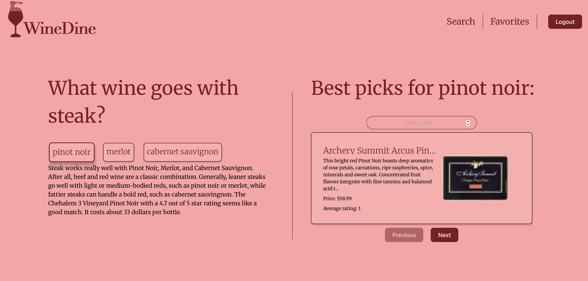

# WineDine

## Inleiding

**WineDine** is de digitale sommelier die je precies vertelt welke wijnen passen bij de gerechten die je maakt. Je laat
de
app weten welk gerecht je op de planning hebt en WineDine geeft je vervolgens een mooi overzicht van wijnen die hier
goed mee samen gaan. Selecteer een wijn om hier meer informatie over te lezen. Ben je overtuigd? Volg dan de link om
deze wijn te kopen. Heb je meerdere wijnen die je interesse wekken? Of behoort een wijn tot de toppers na deze te
proeven? Voeg deze dan toe aan jouw persoonlijke favorietenlijstje. Zo zul je altijd een goede indruk maken op je
vrienden. WineDine, de sommelier op zak.

## Inhoudsopgave

1. Features
2. Screenshot
3. Technologieën
4. Installatie

## Features

- Zoek op gerecht en vind passende wijnsuggesties
- Bekijk aanbevolen wijncategorieën en wijnen
- Bekijk de beschrijvingen, prijs en beoordelingen per wijn
- Sla wijnen op in je favorieten
- Registratie & login

## Screenshot



## Technologieën

- React (Vite)
- React Router DOM
- Axios
- JWT-decode
- Spoonacular API
- CSS Modules

## Installatie

1. **Clone de repository naar WebStorm**
   ```bash
   git clone https://github.com/M-Bakker/winedine.git
   cd winedine

2. **Installeer de basis-dependencies**

```npm install```

3. **Installeer de extra benodigde packages**

```npm install react-router-dom axios jwt-decode```

4. **Voeg een `.env` bestand toe om je API key in op te slaan**

- Run het volgende commando
   ```bash
   echo "VITE_SPOONACULAR_API_KEY=5243fc8405cc4e8690befacd8ab636c6" > .env


5. Start de applicatie

```npm run dev```

6. Open de applicatie in je webbrowser

Ga naar: http://localhost:5173/

7. Login of registreer een nieuwe gebruiker

- Gebruik je de applicatie voor het eerst? Klik dan op 'register here'. Kies een gebruikersnaam, vul je email-adres in
  en kies een wachtwoord van minimaal 6 karakters.
- Heb je al een account? Je kunt direct inloggen.

8. Beperking zoekopdrachten

Helaas beperkt de applicatie zich momenteel nog tot de volgende zoekopdrachten:

   "steak", "pasta carbonara", "pork", "duck", "cheddar", "scallops", "tofu", "hamburger",
   "lasagna", "ravioli", "risotto", "caesar salad", "beef stew", "burrito", "quesadilla", "enchiladas",
   "ramen", "pho", "bibimbap", "paella", "curry", "biryani", "samosa", "spring rolls", "oysters",
   "scampi", "chicken tikka masala", "fajitas", "gnocchi", "bruschetta", "dim sum", "kung pao chicken",
   "coq au vin", "beef bourguignon", "goulash", "mac and cheese", "baked ziti", "pot roast",
   "carbonara", "eggplant parmesan",

**Veel plezier!**